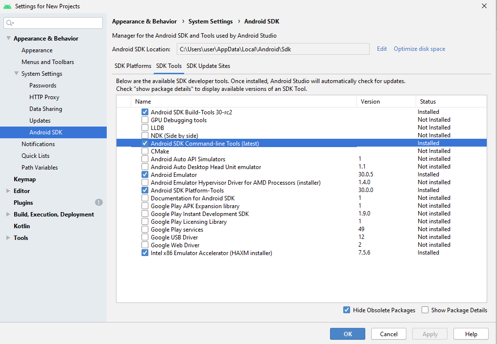
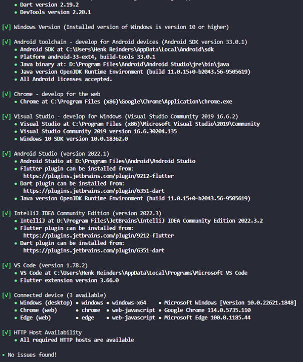

# Smart Grid Table Application
This repository contains the code and documentation related to the Smart Grid Table Application (SGT-App). Furthermore, there are also installation- and user guides available. To be able to run and build the application yourself you can refer to the installation guide. If you just want to use the app you can get it from the ``releases/`` folder located inside of this directory.

# Installation Guide
The application is build using [flutter](https://flutter.dev/). So to be able to build and deploy the application it is required to [install flutter](https://docs.flutter.dev/get-started/install). But first there are a couple dependencies that must be resolved before we can start using flutter.

## Installing Android Studio
To be able to compile and build flutter for android devices, we first need to install [Android Studio](https://developer.android.com/studio/install?gclid=CjwKCAjwkLCkBhA9EiwAka9QRglfbeszFNtRV6oby7EKhNj8pZZmXXzVSsjk6_oY-WcpaBNBpRkM3hoC5-wQAvD_BwE&gclsrc=aw.ds). Through android studio, we will be able to install the **Android SDK Command-line Tools**. in *Android Studio* go to Tools -> SDK Manager. Go to SDK Tools tab. Select the Android SDK Command-line Tools (latest) and download by pressing Apply.



## Installing flutter
If you haven't already, you will need to [install flutter](https://docs.flutter.dev/get-started/install). After installing flutter, run the following to verify the installation:
```
flutter doctor -v
```

The result should look something like this:



You might need to accept some android licenses. This can be done through:
```
flutter doctor --android-licenses
```

## Resolving project dependencies
After finishing the flutter installation run the following from the root directory of the project:

```
flutter pub get
```

To generate the code documentation, we must first enable dart doc. To do this run:
```
dart pub global activate dhttpd
```

Then to generate the documentation run:
```
dart doc .
```
Then to view the code documentation, eiter open the `index.html` file or run:
```
dhttpd --path doc/api
```

And open a webpage on ``localhost:8080``.

# Using the code
To build and run the project use:
```
flutter run
```

To build a release for a platform use:
```
flutter build <platform>
```


# More Documentation
Further documentation regarding the configuring of the parameters can be found in [Parameters Configuration](/docs/module_view_documentation.md).

https://gitlab.com/smart-grid-table/sgt-app.git