# Module View Documentation
This document contains the documentation regarding the structure and definition of the modules contained in the application. There is also an extensive guide regarding the **rules** and **restrictions** defining the parameter fields that can be modified within the application. And lastly there is a user guide for implementing new parameters in the config file.

# Overview
This document contains a couple of main sections. These are:
- [Module structure](#module-structure)
- [Module accesibility](#module-accesibility)
- [User Guide](#user-guide)
- [Restrictions Config](#restrictions-config)

# Module Structure
All modules contain a couple of static fields, these fields are expected to be supplied. The only allowed modification to these fields are *write*, *range* and *visibility* restrictions. These static fields are:
- name
- voltage
- generators
- storages
- transformers
- loads

While `name` and `voltage` are expected to be editable fields, `generators`, `storages`, `transformers` and `loads` (also referred to as *component fields/lists*) are expected to be lists containing components of the predefined structure in the *restrictions* config.

Unlike these static fields, the structure of a component in one of the component lists is dynamic. As long as its defined in the *restrictions* config, the field can be modified within the application accordingly. Below is a preview of the mentioned fields.

```
"name": <field value>,
"voltage": <field value>,
"generators": {
  "<parameter 1>": <field value>,
  "<parameter 2>": <field value>,
  "<parameter N>": <field value>
},
"storages": {
  "<parameter 1>": <field value>,
  "<parameter 2>": <field value>,
  "<parameter N>": <field value>
},
"transformers": {
  "<parameter 1>": <field value>,
  "<parameter 2>": <field value>,
  "<parameter N>": <field value>
},
"loads": {
  "<parameter 1>": <field value>,
  "<parameter 2>": <field value>,
  "<parameter N>": <field value>
}
```

# Module Accessibility
Depending on the difficulty level, limitation can be placed on the changeability of a certain parameter. For **beginner** users, all non-list type parameters are only changeable between zero and its default value. **Advanced** users have full control over parameter fields. Refer to section [Type Restrictions](#type-restrictions) for more on parameter types.

# User Guide
There a couple of steps required to define new parameters in the config file. When parameters are not defined, they will not show up on the user interface. A parameter must be defined in all different sections of the [restrictions config](#restrictions-config) file.

## Step 1: Defining the parameter type
The first step is to [specify the parameter type](#type-definition). For all available types refer to the section [Type Restrictions](#type-restrictions).

## Step 2: Defining the range restrictions
Depending on the type specified in the previous step, a different [range definition](#range-restrictions) must be made. All types except for `list`, `doublelist` and `intlist` must be set to `null`. For `list` types the available options must be specified. For `doublelist` and `intlist` types, the length of the array must be specified.

## Step 3: Defining the writability
[Write restrictions](#write-restrictions) are user specific and thus must be defined for all different users. If a user should be allowed to change the parameter, the value must be set to `false`. If a user must not be able to change the parameter, it must be set to `true`.

## Step 4: Defining the Visibility Restrictions
[Visibility restrictions](#write-restrictions) are also user specific and must also be defined for all different users. If a user should be allowed see the parameter, the value must be set to `false`. If a user must not be able to see the parameter, it must be set to `true`.

## Step 5: Defining the parameter name
[Alternative parameter names](#alternative-parameter-names) can be specified to change the display name of a parameter. These are also user specific. If no different name is needed, `null` must be provided. Otherwise specify the alternative for the name.

# Restrictions config
The **Restrictions** config file contains all constraints and rules related to how parameters are defined within the application. It is located in the source files of the simulation code. There are a number different type of restrictions and configurables in the config file. Some are global and some user specific. These restrictions are:

Global:
- Type Restrictions
- Range Restrictions
  
User Specific:
  - Write Restrictions
  - Visibility Restrictions
  - Alternative Parameter Names

## Type Restrictions
The type restrictions are for defining the field type of a certain parameter. There are a number of predefined field types. These are:
- int (integers)
- intlist (list of integers)
- double (rational numbers)
- doublelist (list of rational numbers)
- string (a normal text field)
- list (list of strings)

### Field Types: int
--------------------
The `int` field type can only contain integer numbers. Anything else is rejected. For **beginner** users, values can only be changed between zero and it's default value by using a slider or textfield. Below the beginner version is shown.

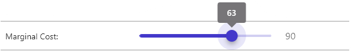

And the advanced user version.

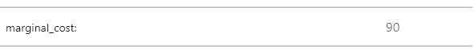

### Field Types: intlist
------------------------
The `intlist` field type is a hybrid field of an integer or an array of integers. Only the **Advanced** users have access to this field. Using the arrow button can be toggled between the array editor and the single textfield. Below the single integer field is shown.

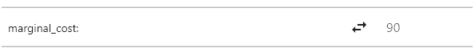

And the array of integers field.

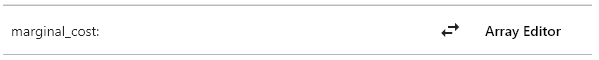

By pressing the button, the user can open the *Array Editor* page. This page can be seen in the image below.

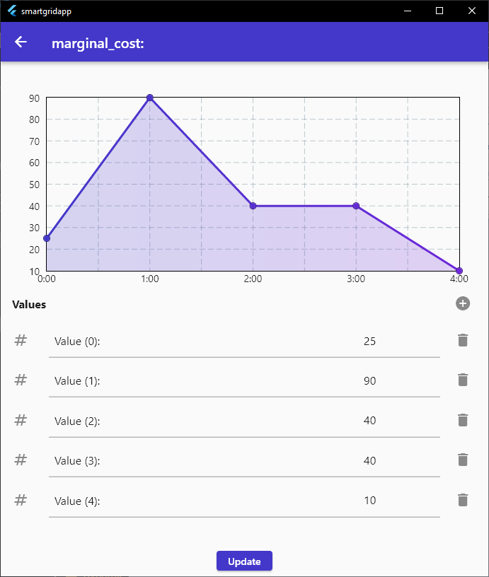

### Field Types: double
-----------------------
The `double` field type can only contain rational numbers. Anything else is rejected. For **beginner** users, values can only be changed between zero and it's default value by using a slider or textfield. Below the beginner version is shown.

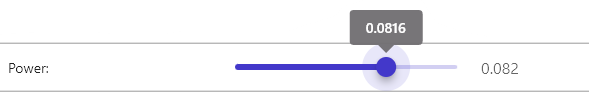

And the advanced user version.

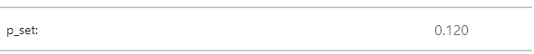

### Field Types: doublelist
---------------------------
The `doublelist` field type is a hybrid field of a double or an array of doubles. Only the **Advanced** users have access to this field. Using the arrow button can be toggled between the array editor and the single textfield. Below the single `double` field is shown.

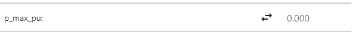

And the array of doubles field.

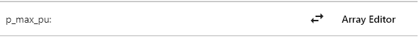

By pressing the button, the user can open the *Array Editor* page. This page can be seen in the image below.

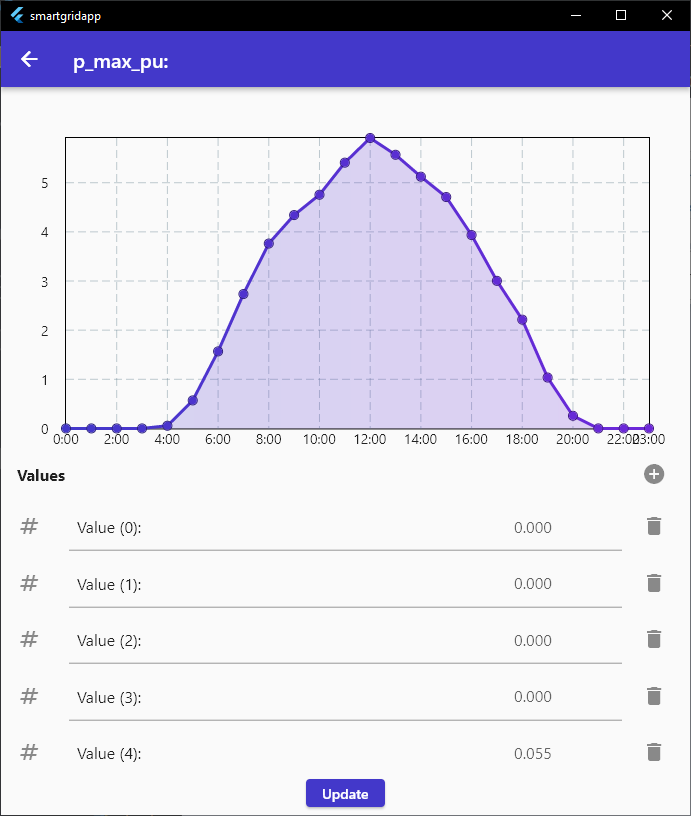

### Field Types: string
-----------------------
The `string` field type can only contain characters. Anything else is rejected. The functionality of this field does not change depending on the type of user. Below is an image of what the `string` field looks like.

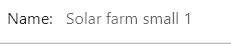

### Field Types: list
---------------------
The list field type is different from the `doublelist` and `intlist` types. It contains a series of predefined string options from which one can be selected through a dropdown menu. Below is an image of what the list field looks like.

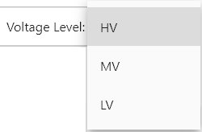

### Type Definition
-------------------
Below is an example of how one can define the variable type.
```
"type_restrictions": {
  "name": "string",
  "voltage": "list",
  "generators": {
    "type": "string",
    "p_nom": "double",
    "p_max_pu": "doublelist",
    "p_min_pu": "double",
    "p_nom_min": "double",
    "p_nom_max": "double",
    "p_nom_extendable": "list",
    "marginal_cost": "intlist"
  }
}
```

## Range Restrictions
The range restrictions are for defining allowed range or allowed values for a certain field. Range restrictions are not user specific. For now, the only supported fields `list`, `doublelist` and `intlist` type fields. If a field does not have any range restrictions, it should be set to `null`. For `list` types, an array of string values must be supplied. These will be the options a user will be able to choose from within the application. For `doublelist` and `intlist` type fields an integer must be provided. This will be the static length of the array. Below is an example of how one can define such a field:

```
"range_restrictions": {
  "name": null,
  "voltage": ["HV", "MV", "LV"],
  "generators": {
    "type": null,
    "p_nom_min": null,
    "p_nom_max": null,
    "p_nom_extendable": ["True", "False"],
    "marginal_cost": null
  }
}
```
## Write Restrictions
The write restrictions are for setting the write access to certain field for a specific user. Only two values are allowed. These are `true` and `false`. The syntax for setting the write access of a specific field is pretty simple. Simply specify the field and set it to either `true` or `false`. When set to `true`, the user can not edit the field. When set to `false`, the user can edit the field. Below an example of the definition is shown.
```
"write_restrictions": {
  "Beginner": {
    "name": false,
    "voltage": true,
  }
}
```
## Visibility Restrictions
The visibility restrictions are for defining if a specific user is able to see a field. Just like the [write restrictions](#write-restrictions), the only allowed values are `true` and `false`. When set to `true`, the user can see the field. When set to `false`, the user can not see the field. Below an example of the definition is shown.
```
"visibility_restrictions": {
  "Beginner": {
    "name": false,
    "voltage": true,
  }
}
```

## Alternative Parameter Names
The alternative parameter names field is for displaying nicer names then those used in the config file. These are also user specific. When none are provided, `null` must be supplied. Then the default name will be used. Below an example of the definition is shown.
```
"alternative_parameter_names": {
  "Beginner": {
    "name": "Name",
    "voltage": "Voltage Level",
    "generators": {
      "type": "Component Type",
      "p_nom": "Nominal Power",
      "p_max_pu": "Max Power Per Unit",
      "p_min_pu": "Min Power Per Unit",
      "p_nom_min": "Minimal Power",
      "p_nom_max": null,
      "p_nom_extendable": null,
      "marginal_cost": null
    }
  }
}
```
